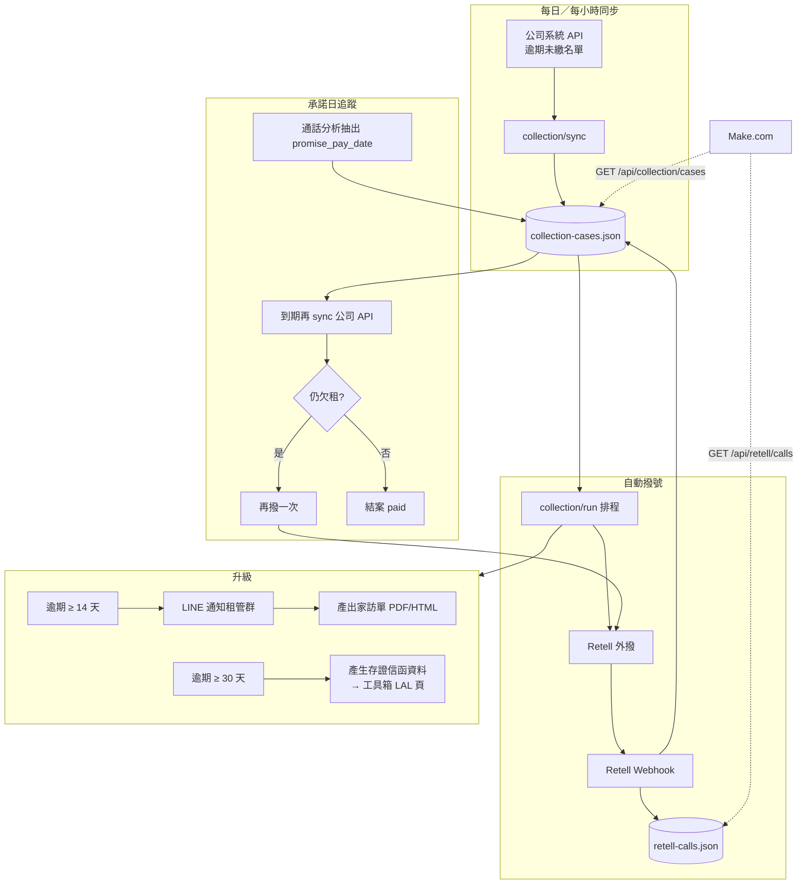

# 催收自動化藍圖（公司 API → Retell → 升級）

> 目標：自動撈逾期未繳 → AI 撥號 → 記錄承諾還款日 → 到期未繳再撈再撥 → 14 天 LINE＋家訪單 → 30 天存證信函

---

## 整體架構



---

## 案件狀態（state）

| 狀態 | 說明 |
|------|------|
| `overdue` | 公司 API 確認欠租，尚未撥號 |
| `dialing` | 已送出 Retell 撥號 |
| `waiting_promise` | 已通話，等待承諾繳款日 |
| `promise_overdue` | 承諾日已過，待再查公司 API |
| `recall` | 確認仍欠租，排程再撥 |
| `paid` | 公司已無欠租，結案 |
| `escalated_14` | 已執行 14 天升級（LINE＋家訪單） |
| `escalated_30` | 已執行 30 天升級（存證信函） |

---

## 規則摘要

| 條件 | 動作 |
|------|------|
| 新進欠租案、當日未撥過 | Retell 外撥 |
| 未接／忙線 | 隔日再撥（可設上限，例 3 次） |
| `call_analyzed` 有承諾日 | 寫入 `promise_pay_date`，狀態 → `waiting_promise` |
| 今日 > 承諾日 | 呼叫公司 API 查是否已繳 |
| 仍欠租 | 狀態 → `recall`，再撥 |
| 已繳清 | 狀態 → `paid` |
| `overdue_days ≥ 14` 且未做過 | LINE 通知 ＋ 產生家訪單 |
| `overdue_days ≥ 30` 且未做過 | 產生存證信函草稿（JSON，可開工具箱 LAL 頁） |

天數以 **公司 API 的欠租起算日** 為準（與租管 SOP 對齊後可調）。

---

## 你需要提供的公司 API（待串接）

在 `server/config.json` → `companyApi`：

```json
{
  "baseUrl": "https://erp.company.tw/api",
  "apiKey": "",
  "overduePath": "/rent/overdue",
  "paymentStatusPath": "/rent/payment-status"
}
```

**預期回傳（每筆）**——實際欄位名可再對應 `company-api.js`：

| 欄位 | 說明 |
|------|------|
| `case_id` | 案號（唯一鍵） |
| `tenant_name` | 房客 |
| `tenant_phone` | 手機 |
| `property_address` | 地址 |
| `rent_month` | 欠租月份 |
| `rent_amount` | 金額 |
| `overdue_since` | 欠租起算日 ISO |
| `is_paid` | 是否已繳清 |

查單案：`GET paymentStatusPath?case_id=xxx` → `{ is_paid: boolean }`

---

## Retell 設定（承諾還款日）

在 Retell Agent → **Post-call Analysis** 新增自訂欄位：

- `promise_pay_date`（文字，例：`2026-05-25` 或 `5月25日`）

話術要引導房客說出明確日期，分析才抓得到。

Webhook 已會寫入 `retell-calls.json`，排程會同步到 `collection-cases.json`。

---

## Make.com 角色建議

| 模組 | 用途 |
|------|------|
| 排程每 15 分 | `POST /api/collection/run`（或公司主機內建 cron） |
| HTTP GET | `/api/collection/cases?status=escalated_14` 同步 CRM |
| HTTP GET | `/api/retell/calls?since=...` 同步通話紀錄 |
| Google Sheet / Notion | 家訪單、存證信函待辦 |

也可 **不用 Make 跑核心邏輯**，只用 Make 做「資料匯出到別系統」。

---

## API 一覽（已實作骨架）

| 方法 | 路徑 | 說明 |
|------|------|------|
| POST | `/api/collection/sync` | 從公司 API 同步欠租案 |
| POST | `/api/collection/run` | 執行一輪：同步＋撥號＋升級 |
| GET | `/api/collection/cases` | 案件列表（Make.com 可撈） |
| GET | `/api/collection/cases/:id` | 單案含通話、文件連結 |
| GET | `/api/collection/documents/:caseId/home-visit` | 家訪單 HTML |
| GET | `/api/collection/documents/:caseId/lal-payload` | 存證信函用 JSON |

驗證：`X-Admin-Key` 或 `X-API-Key`（makeApiKey）

---

## 實作階段建議

| 階段 | 內容 |
|------|------|
| **P0（現在）** | 骨架 + 手動 `run` + 示範公司 API JSON |
| **P1** | 接上真實公司 API、Retell 承諾日分析 |
| **P2** | LINE 通知、家訪單版型定稿 |
| **P3** | 存證信函與工具箱 LAL 頁一鍵帶入 |
| **P4** | 主管後台審核（自動產出前人工確認） |

---

## 法遵提醒

- 自動外撥頻率上限、勿深夜撥打
- 通話開始表明身分與公司名
- 存證信函、終止租約前須租管／法務 SOP 審核
- 個資僅內部 API，不進前端
